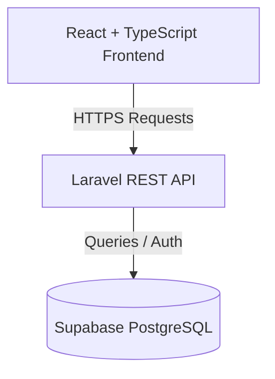

<div align="center">
  <!--  -->
  <h1 align="center">Eventhub</h1>

  <p align="center">
    A modern, responsive, and streamlined Event Management System.
    <br />
    <br />
    <a href="#getting-started">Getting Started</a>
    ·
    <a href="#features">View Features</a>
    ·
    <a href="#roadmap">Roadmap</a>
  </p>

  <!-- Badges -->
  <p align="center">
    
    
    
    
  </p>
</div>

## 📋 Table of Contents
<details>
  <summary>Click to expand</summary>

  1. [About The Project](#about-the-project)
      - [Built With](#built-with)
  2. [Features](#features)
  3. [System Architecture](#system-architecture)
  4. [Getting Started](#getting-started)
      - [Prerequisites](#prerequisites)
      - [Installation](#installation)
  5. [Roadmap](#roadmap)
  6. [Developers](#developers)
  7. [License](#license)
</details>

## 📖 About The Project

<!-- [![Product Name Screen Shot][product-screenshot]](https://example.com) -->
*Screenshot placeholder: Add a beautiful screenshot of the dashboard here.*

**Eventhub** is a web-based Event Management System designed to allow administrators to seamlessly create and manage events, while enabling users to easily register, reserve slots, and check in digitally. Developed as an academic project, it focuses on delivering a streamlined and modern user experience.

### Built With

#### Frontend
*   [React](https://reactjs.org/)
*   [TypeScript](https://www.typescriptlang.org/)
*   [Vite](https://vitejs.dev/)
*   [Tailwind CSS](https://tailwindcss.com/)

#### Backend & Database
*   [PHP](https://www.php.net/) & [Laravel](https://laravel.com/) (REST API)
*   [Supabase](https://supabase.com/) (PostgreSQL, Auth, Storage)

## ✨ Features

### 🛡️ Admin
*   **Event Management:** Create, edit, and delete events (Title, description, venue, date/time, capacity).
*   **Monitoring:** Track live event registrations and attendance records.
*   **Analytics:** Generate event reports and summaries.

### 👤 User
*   **Discovery:** Browse available events.
*   **Registration:** Register and reserve slots/tickets with confirmation.
*   **Digital Check-in:** Seamless check-in using QR Codes or Attendance Codes.

## 🏗️ System Architecture



## 🚀 Getting Started

To get a local copy up and running, follow these simple steps.

### Prerequisites

Ensure you have the following installed:
*   [Node.js](https://nodejs.org/) (v16+)
*   [PHP](https://www.php.net/) (v8.1+)
*   [Composer](https://getcomposer.org/)

Additionally, ensure the following extensions are uncommented in your `php.ini`:
`curl`, `exif`, `fileinfo`, `gd`, `gettext`, `mbstring`, `mysqli`, `openssl`, `pdo_mysql`, `pdo_pgsql`, `pdo_sqlite`, `pgsql`, `zip`.

### Installation

1. **Clone the repo**
   ```sh
   git clone https://github.com/your-username/eventhub.git
   cd eventhub
   ```

2. **Frontend Setup**
   ```sh
   cd client
   npm install
   # Create a .env file and configure variables
   npm run dev
   ```

3. **Backend Setup**
   *(In a new terminal window)*
   ```sh
   cd server
   composer install
   # Create a .env file and configure variables
   php artisan serve
   ```

## 🛣️ Roadmap

- [ ] QR Code Generation & Scanning
- [ ] Email Notifications
- [ ] Role-Based Authentication
- [ ] Event Categories & Tags
- [ ] Dashboard Analytics
- [ ] PDF Report Export
- [ ] Real-Time Notifications
- [ ] Mobile Responsive Enhancements

## 👨‍💻 Developers

Developed by:
*   Bobadilla, Mark Allen G.
*   Degulacion, Sharwyn C.
*   Gutierrez, Marcus Jenne C.
*   Logdat, Karl Joseph M.

## 📄 License

Distributed under the MIT License. You are free to use, modify, and distribute this software for educational and personal purposes.
